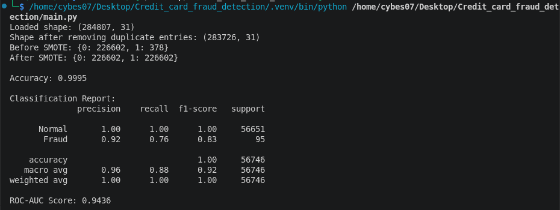
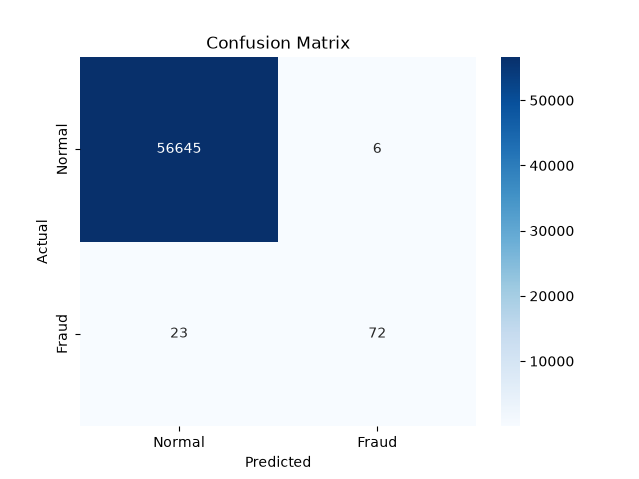

# Credit Card Fraud Detection

A machine learning pipeline that detects fraudulent credit card transactions using a Random Forest classifier, with SMOTE to handle the extreme class imbalance typical of fraud data.

## Overview

The pipeline in `main.py` runs end-to-end: load → dedupe → preprocess → stratified split → SMOTE (train only) → train Random Forest → evaluate. Each step is broken down below.

## Pipeline Walkthrough

### 1. `load_data()` — Load & de-duplicate

```python
df = pd.read_csv(path)
df = df.drop_duplicates()
```

Reads `creditcard.csv` into a DataFrame and prints its shape before/after. It then drops exact duplicate rows. Credit card datasets (this one especially) commonly contain repeated transaction records; if left in, the same transaction could end up in *both* the train and test split, letting the model "memorize" it rather than generalize, and quietly inflating test accuracy.

### 2. `preprocess()` — Scale & split features/label

```python
scaler = StandardScaler()
df["scaled_amount"] = scaler.fit_transform(df[["Amount"]])
df["scaled_time"] = scaler.fit_transform(df[["Time"]])
df = df.drop(["Amount", "Time"], axis=1)

X = df.drop("Class", axis=1)
y = df["Class"]
```

The dataset's `V1`–`V28` columns are already PCA components, roughly on the same small scale. `Amount` (transaction value) and `Time` (seconds since the first transaction) are not — they can range into the thousands or more. Left unscaled, a distance- or magnitude-sensitive step could let those two columns dominate purely because of their scale, not because they're more predictive. `StandardScaler` rescales each to mean 0 / std 1 (`scaled_amount`, `scaled_time`), and the raw `Amount`/`Time` columns are dropped. Finally the frame is split into features `X` and the label `y` (`Class`: 0 = normal, 1 = fraud).

### 3. `split_and_balance()` — Stratified split + SMOTE

```python
X_train, X_test, y_train, y_test = train_test_split(
    X, y, test_size=test_size, random_state=random_state, stratify=y
)
smote = SMOTE(random_state=random_state)
X_train_res, y_train_res = smote.fit_resample(X_train, y_train)
```

`stratify=y` guarantees the train and test sets each keep the same (tiny) fraud ratio as the full dataset — a plain random split risks leaving too few fraud cases in one side.

Fraud is under 1% of transactions. Trained as-is, a classifier can hit ~99%+ accuracy just by predicting "normal" every time, while never actually catching fraud. **SMOTE** (Synthetic Minority Over-sampling Technique) fixes this by generating synthetic fraud examples — interpolated between real fraud cases' nearest neighbors — until the minority class matches the majority class in size. Critically, this is applied **only to `X_train`/`y_train`**; `X_test`/`y_test` are left untouched, so evaluation still reflects real-world class imbalance rather than an artificially balanced one.

### 4. `train_model()` — Random Forest

```python
model = RandomForestClassifier(n_estimators=100, random_state=random_state, n_jobs=-1)
model.fit(X_train, y_train)
```

Fits 100 decision trees (`n_estimators=100`) in parallel (`n_jobs=-1` uses all CPU cores) on the SMOTE-balanced training data. See [Why Random Forest?](#why-random-forest) below for the reasoning.

### 5. `evaluate_model()` — Metrics & plots

```python
y_pred = model.predict(X_test)
y_proba = model.predict_proba(X_test)[:, 1]
```

- **Accuracy** — printed for reference, but flagged as misleading alone (see note below).
- **Classification report** — precision, recall, and F1 for both classes; recall on the `Fraud` class is the number that matters most (what fraction of actual fraud did the model catch?).
- **ROC-AUC** — computed from `y_proba` (the predicted probability of fraud), summarizing how well the model ranks fraud above normal transactions across all thresholds.
- **Confusion matrix** (`assets/confusion_matrix.png`) — a heatmap of true vs. predicted labels: true positives (fraud caught), false negatives (fraud missed), false positives (false alarms), true negatives (normal correctly cleared).
- **ROC curve** (`assets/roc_curve.png`) — true positive rate vs. false positive rate across thresholds, with the diagonal representing random guessing for comparison.

### 6. `main()` — Orchestration

Simply calls the five functions above in order: `load_data → preprocess → split_and_balance → train_model → evaluate_model`.

## Why Random Forest?

- Fraud vs. normal is a non-linear, messy decision boundary across 30 features — harder for a linear model like Logistic Regression to separate well.
- As an ensemble of trees, it's far less prone to overfitting than a single decision tree, while still capturing complex feature interactions.
- No feature scaling required to perform well, and it handles the mix of PCA components + scaled `Amount`/`Time` cleanly.
- Works naturally with the SMOTE-balanced training data and gives feature importances for free.
- Fast to train with solid results out of the box — a good first working model for fraud detection.

## Project Structure

```
.
├── assets/               # Output plots generated by evaluate_model()
│   ├── Confusion_matrix.png
│   ├── ROC Curve.png
│   └── terminal.png
├── src/                  # Supporting source modules
├── creditcard.csv        # Dataset (Time, Amount, V1–V28, Class)
├── main.py               # Full pipeline: load → preprocess → SMOTE → train → evaluate
├── pyproject.toml        # Project dependencies (managed with uv)
├── uv.lock               # Locked dependency versions
├── setup.sh              # One-command environment setup (installs uv + syncs deps)
└── README.md
```

## Output

Running `main.py` prints load/dedup shapes, the class counts before/after SMOTE, then the metrics, and pops up two plot windows:

**Terminal output**



**Confusion Matrix**



**ROC Curve**


## Dataset

Expects the standard "Credit Card Fraud Detection" dataset format: 28 anonymised PCA features (`V1`–`V28`), plus `Time`, `Amount`, and a binary `Class` label (`0` = normal, `1` = fraud). Place `creditcard.csv` in the project root before running.

## Setup

This project uses [uv](https://docs.astral.sh/uv/) for dependency management. To set everything up in one step:

```bash
chmod +x setup.sh
./setup.sh
```

This will:
- Install `uv` if it isn't already on your system
- Run `uv sync` to install the exact dependency versions pinned in `pyproject.toml` / `uv.lock` into a local `.venv`

## Usage

Run the pipeline with:

```bash
uv run python main.py
```

or activate the virtual environment first:

```bash
source .venv/bin/activate
python main.py
```

The confusion matrix and ROC curve will pop up as plot windows; classification metrics print to the terminal.

## Key Dependencies

- `pandas`
- `scikit-learn`
- `imbalanced-learn` (SMOTE)
- `matplotlib`
- `seaborn`

Exact versions are pinned in `uv.lock`.

## Notes

- Accuracy alone is misleading on this data (predicting "normal" for every transaction already scores ~99.8%), so precision/recall/F1 and ROC-AUC are the metrics that actually reflect fraud-catching performance.
- SMOTE is applied only to the training split — the test set is left untouched so evaluation reflects real-world class imbalance.